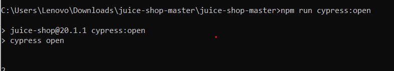
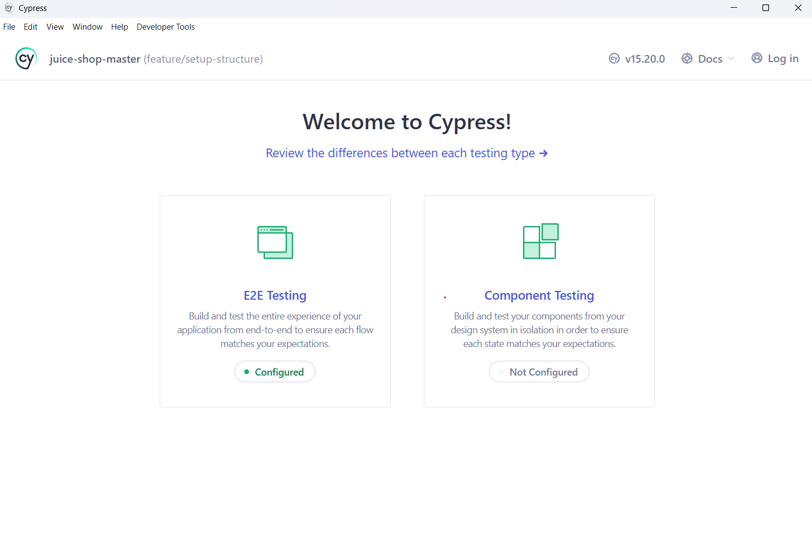
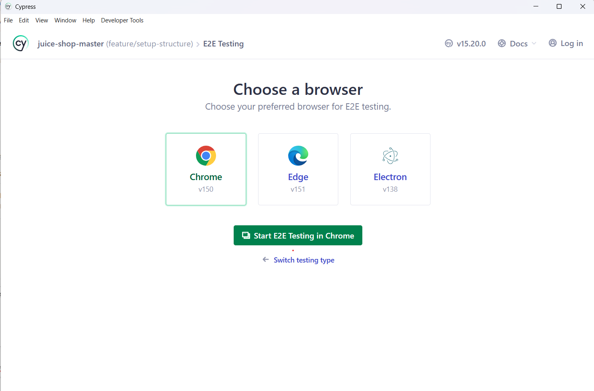
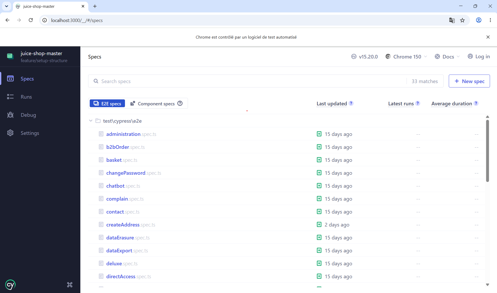
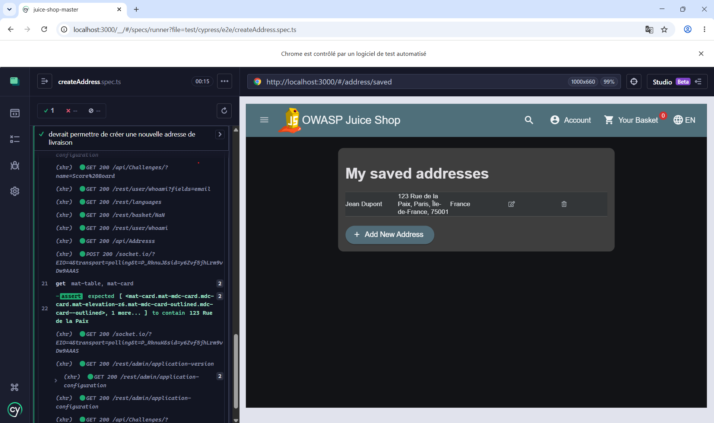
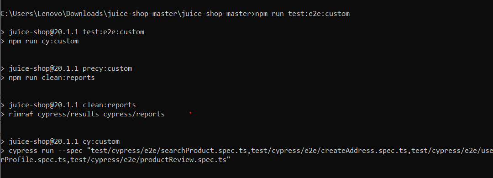
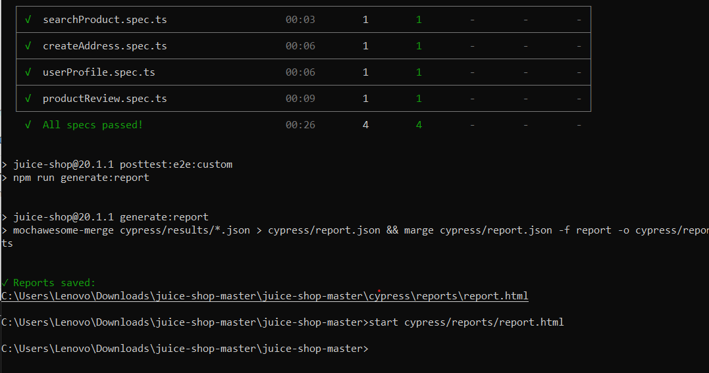
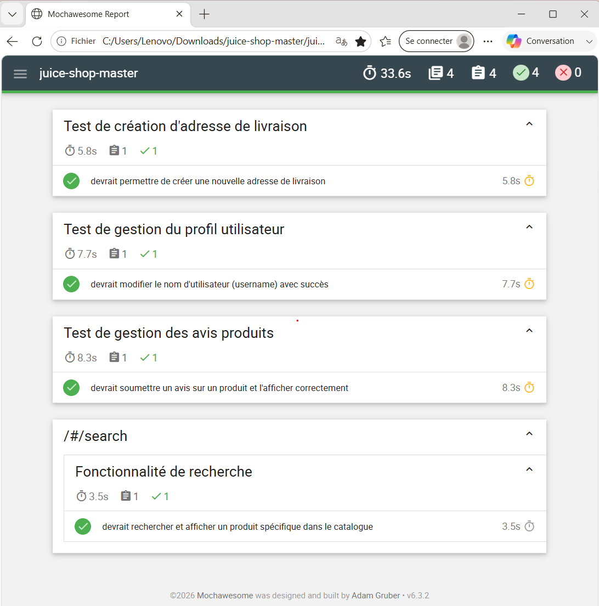

# Documentation Technique : Suite de Tests E2E Cypress & Reporting Mochawesome

## 1. Vue d'ensemble du Projet

Ce projet met en place une suite de tests automatisés End-to-End (E2E) pour l'application **OWASP Juice Shop** en utilisant **Cypress**. L'objectif est de valider les fonctionnalités critiques de l'interface utilisateur et de générer automatiquement un rapport d'exécution HTML interactif via **Mochawesome**.

---

## 2. Périmètre des Tests (Target Scope)

La suite de tests cible 4 scénarios utilisateurs majeurs :

| Scénario | Fichier | Description |
| --- | --- | --- |
| Recherche de Produit | `searchProduct.spec.ts` | Vérifie le moteur de recherche et l'affichage des résultats dans le catalogue. |
| Création d'Adresse | `createAddress.spec.ts` | Valide le formulaire d'ajout d'une nouvelle adresse de livraison. |
| Gestion du Profil | `userProfile.spec.ts` | Teste la modification des informations utilisateur (mise à jour du username). |
| Avis Produit | `productReview.spec.ts` | Contrôle la soumission et l'affichage des avis sur un produit. |

---

## 3. Architecture du Pipeline de Reporting

Le pipeline s'appuie sur trois phases séquentielles :

1. **Nettoyage** (`clean:reports`) — Purge des anciens rapports bruts et finaux via `rimraf`.
2. **Exécution** (`cy:custom`) — Lancement ciblé des 4 spécifications en mode headless. Chaque fichier produit un rapport intermédiaire `.json` dans `cypress/results/`.
3. **Compilation** (`generate:report`) — Fusion des fichiers JSON avec `mochawesome-merge` (`cypress/report.json`), puis conversion en rapport HTML visuel autonome via `marge` dans `cypress/reports/`.

---

## 4. Guide d'Exécution

### 4.1 Prérequis

* **Node.js** (v18+)
* L'application Juice Shop démarrée sur `http://localhost:3000` (`npm start`)

### 4.2 Scripts disponibles (`package.json`)

| Script | Commande | Description |
| --- | --- | --- |
| `test:e2e:custom` | `npm run test:e2e:custom` | **Commande principale** : exécute le nettoyage, lance les 4 tests et génère le rapport HTML. |
| `clean:reports` | `rimraf cypress/results cypress/reports cypress/report.json` | Supprime tous les résidus des exécutions précédentes. |
| `generate:report` | `mochawesome-merge ... && marge ...` | Compile les fichiers JSON bruts en rapport HTML unique. |

---

## 5. Exécution Manuelle via l'Interface Cypress

Cette section montre comment lancer un test individuel via l'interface graphique de Cypress, étape par étape.

### 5.1 Lancer l'interface Cypress

Ouvre un terminal à la racine du projet et exécute :

```bash
npm run cypress:open
```



### 5.2 Choisir le type de test : E2E Testing

Dans l'écran d'accueil, sélectionne **E2E Testing** (et non Component Testing).



### 5.3 Choisir le navigateur : Chrome

Sélectionne **Chrome**, puis clique sur **Start E2E Testing in Chrome**.



### 5.4 Sélectionner une spec à exécuter

Dans la liste des specs (`test/cypress/e2e`), clique sur le fichier de test à lancer, par exemple `createAddress.spec.ts`.



### 5.5 Résultat : test exécuté avec succès

Le test s'exécute dans le navigateur et le statut passe au vert (✓), confirmant le succès du scénario.



---

## 6. Exécution Automatisée en Ligne de Commande

Pour exécuter les 4 specs d'un coup (sans passer par l'interface graphique) et générer le rapport final, utilise la commande principale :

```bash
npm run test:e2e:custom
```

Le pipeline enchaîne automatiquement le nettoyage, l'exécution headless des 4 specs, puis la génération du rapport :



À la fin de l'exécution, le terminal affiche le récapitulatif de chaque spec (statut, durée) ainsi que le chemin du rapport HTML généré :



---

## 7. Consultation des Résultats

Une fois l'exécution terminée, le rapport visuel est généré dans le dossier `cypress/reports/`.

Pour l'ouvrir :

```bash
npm run cypress:open
```

Le rapport synthétise :

* Le nombre total de tests exécutés, réussis, échoués ou ignorés.
* La durée d'exécution globale et par spec.
* Le détail étape par étape de chaque assertion Cypress.


