# Documentation Jenkins — Sprint 1

## Étape 1 : Mettre à jour `docker-compose.yml` et lancer Jenkins

### 1. Ajout d'un réseau de type `bridge network` pour tous les services

**Pourquoi ?**
Pour que plusieurs services (Jenkins, n8n, les conteneurs de tests Cypress/Playwright, Grafana) puissent communiquer entre eux par **leurs noms de service** sans passer par des IP changeantes ou le réseau hôte, il faut les placer dans un réseau Docker dédié (un *bridge network*).

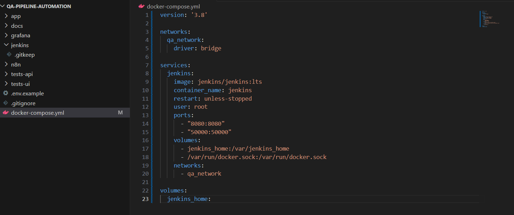

```yaml
networks:
  qa_network:
    driver: bridge

services:
  jenkins:
    image: jenkins/jenkins:lts
    container_name: jenkins
    restart: unless-stopped
    user: root
    ports:
      - "8080:8080"
      - "50000:50000"
    volumes:
      - jenkins_home:/var/jenkins_home
      - /var/run/docker.sock:/var/run/docker.sock
    networks:
      - qa_network

volumes:
  jenkins_home:
```

### 2. Exécution de la commande pour démarrer Jenkins

```bash
docker-compose up -d jenkins
```

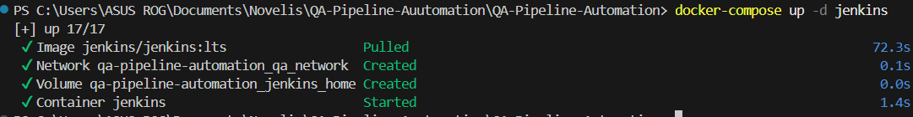

### 3. Récupération du mot de passe administrateur initial

```bash
docker exec jenkins cat /var/jenkins_home/secrets/initialAdminPassword
```

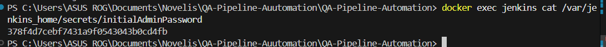

### 4. Configuration initiale via le navigateur

Sur le navigateur, aller sur **http://localhost:8080**, coller le mot de passe, choisir **"Install suggested plugins"**, puis créer le compte utilisateur.

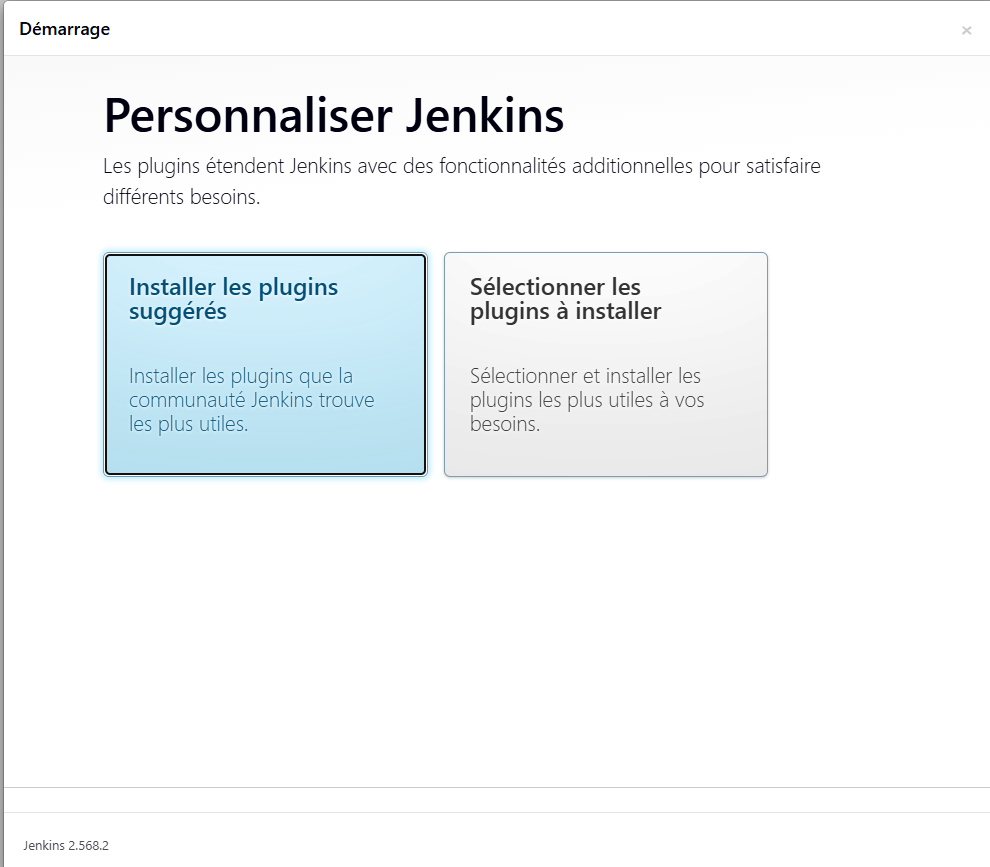

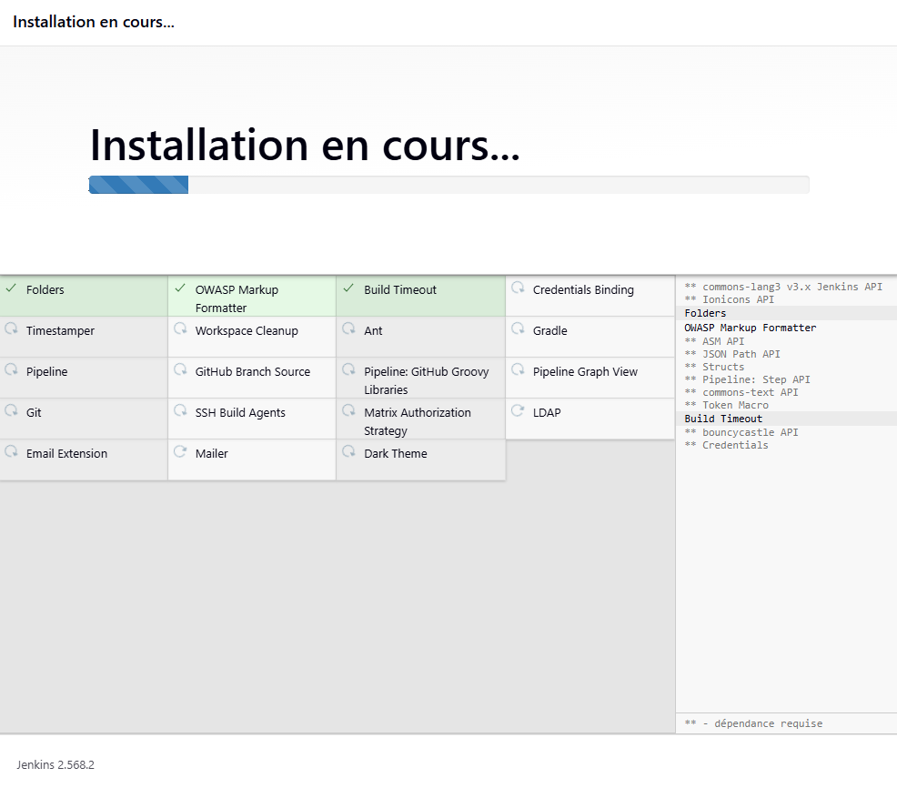

### 5. Création du compte utilisateur

| Champ | Valeur |
|---|---|
| Nom d'utilisateur | `admin` |
| Mot de passe | `admin123` |
| Nom complet | QA Admin |
| Email | rihabaddou1@gmail.com |

> ⚠️ **À adapter** : ces identifiants sont donnés à titre d'exemple pour l'environnement local. Pensez à les modifier avant tout déploiement partagé.

---

## Étape 2 : Créer le fichier `Jenkinsfile` dans le projet

Dans VS Code, sous le dossier `jenkins/`, créer un nouveau fichier nommé `Jenkinsfile` :

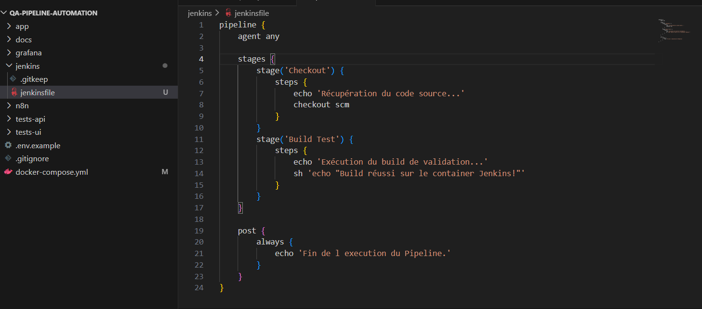

```groovy
pipeline {
    agent any

    stages {
        stage('Checkout') {
            steps {
                echo 'Récupération du code source...'
                checkout scm
            }
        }
        stage('Build Test') {
            steps {
                echo 'Exécution du build de validation...'
                sh 'echo "Build réussi sur le container Jenkins!"'
            }
        }
    }

    post {
        always {
            echo 'Fin de l\'exécution du Pipeline.'
        }
    }
}
```

### Créer un nouveau job dans Jenkins

Créer un nouveau job dans **http://localhost:8080** de type **Pipeline**, avec :
- **SCM** : Git
- **Repository** : le dépôt GitHub contenant le `Jenkinsfile` du projet à builder
- **Branch Specifier** : la branche contenant le Jenkinsfile (ex : `*/feature/setup-structure`)
- **Script Path** : `jenkins/Jenkinsfile`
- Cocher **"GitHub hook trigger for GITScm polling"**

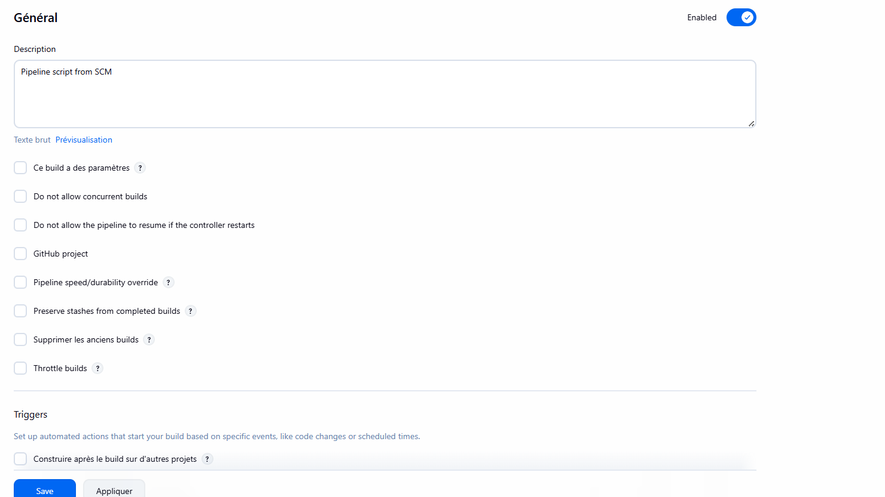

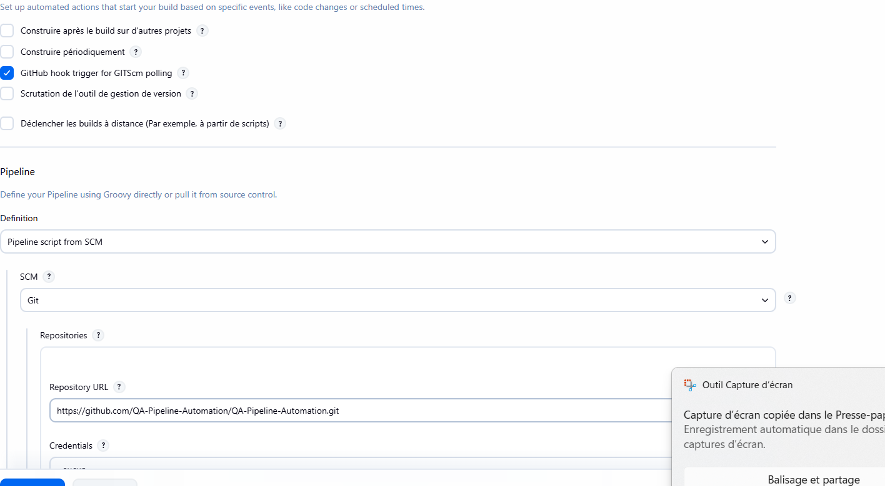

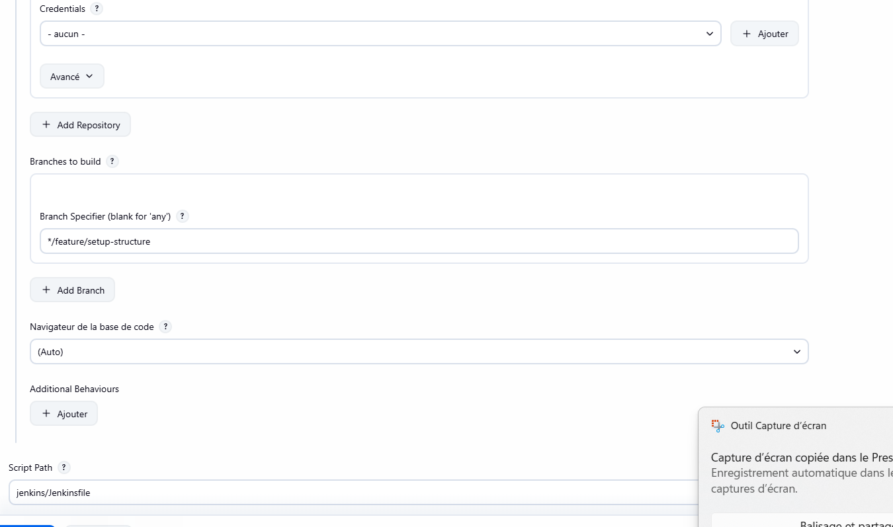

---

## Étape 3 : Configurer le webhook GitHub → Jenkins

### 1. Exposer Jenkins à Internet

GitHub a besoin d'une URL publique pour envoyer les notifications à Jenkins en local (`localhost:8080`).

**Solution : exposer le port Jenkins via [Ngrok](https://ngrok.com/download) pour obtenir une URL publique.**

**Étapes :**

1. Installer le fichier ZIP Windows 64 bits depuis [ngrok.com/download](https://ngrok.com/download)
2. Copier `ngrok.exe` dans le dossier du projet
3. Se connecter à son compte Ngrok via [dashboard.ngrok.com](https://dashboard.ngrok.com)
4. Dans le menu de gauche du dashboard, cliquer sur **Your Authtoken**
5. Dans le terminal PowerShell, configurer le token :

```powershell
.\ngrok.exe config add-authtoken TON_TOKEN_ICI
```

6. Lancer l'exposition du port 8080 :

```powershell
.\ngrok.exe http 8080
```

**Résultat attendu :**

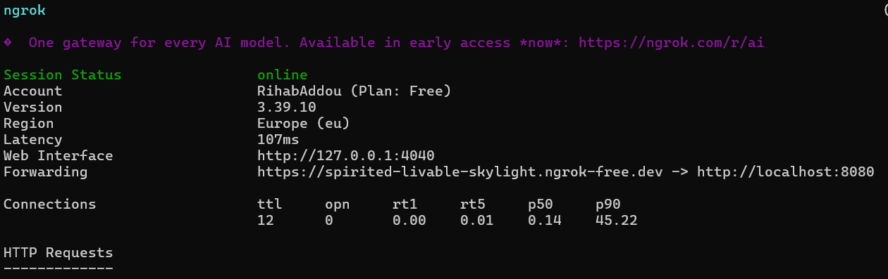

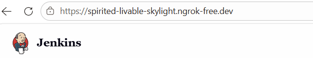

### 2. Mettre à jour l'URL système dans Jenkins

- Aller dans **Administrer Jenkins → Système**
- Repérer la section **Jenkins Location**
- Dans le champ **Jenkins URL**, remplacer `http://localhost:8080/` par l'URL HTTPS générée par Ngrok (ex : `https://xxxx.ngrok-free.dev/`)
- Cliquer sur **Enregistrer**

### 3. Configurer le webhook sur GitHub

- Aller dans le dépôt GitHub → **Settings → Webhooks → Add webhook**
- **Payload URL** : renseigner l'URL Ngrok suivie de `/github-webhook/` (ex : `https://xxxx.ngrok-free.dev/github-webhook/`)
- **Content type** : `application/json`
- **Événements** : laisser sur *Just the push event*
- Cliquer sur **Add webhook**

### 4. Activer le déclencheur dans le job Jenkins

- Ouvrir le job dans Jenkins → **Configurer**
- Aller dans **Build Triggers**
- Cocher **GitHub hook trigger for GITScm polling**
- Enregistrer les modifications

### 5. Valider le fonctionnement

- Dans GitHub, vérifier que le ping de test dans **Recent Deliveries** affiche un statut **200 OK** ✅
- Effectuer un `git push` sur le dépôt : le build Jenkins doit se lancer automatiquement

> ⚠️ **Note importante pour l'équipe**
> Avec un compte Ngrok gratuit, l'URL HTTPS change à chaque redémarrage de la commande `.\ngrok.exe http 8080`.
> Si le terminal Ngrok est fermé, il faudra mettre à jour :
> - la **Jenkins URL** dans Jenkins
> - la **Payload URL** dans GitHub
>
> avec la nouvelle adresse générée.